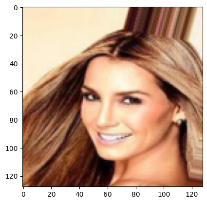
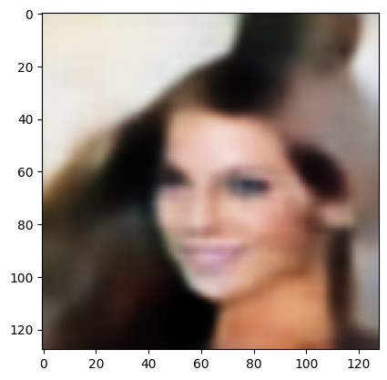
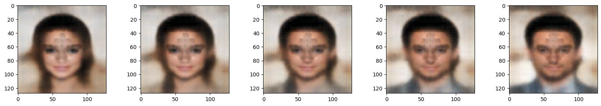

# MiniFaceApp

Implementation from scratch of a Variational Auto-Encoder (VAE) in PyTorch trained on the CelebA dataset.

This project provides a modular architecture, training scripts and reproducible evaluation scripts.

| Original image | Reconstructed image |
|---------|---------|
|  |  |


Playing with the latent space:


## 1. Goal

Propose a clear and entirely modular implementation of a VAE applied to face reconstruction and generation.

## 2. Architecture

**Encoder**
- Progressive convolutional layers
- BatchNorm layer and LeakyReLU activation after each convolutional layer
- Projection to two values : `mu` and `logvar` for the reparametrization trick

- Output : $x = \mu + \exp(\frac{1}{2}logvar).\epsilon$ with $\epsilon \sim \mathcal{N}(0,I)$

**Decoder**
- Successive blocks composed of
  - Upsampling + Convolutional layer (Transposed convolutions resulted in artefacts)
  - BatchNorm + LeakyReLU after
  - For final block : Sigmoid activation
 
**Latent space**
- Configurable dimension

**Loss**\

$\mathcal{L}(\phi, \theta) = - \mathrm{ELBO}(\phi,\theta) = \beta\mathrm{KL}\big(q_{\phi}(z\mid x)\|\|p_{\lambda}(z)\big) - \mathbb{E}\_{q_{\phi}(z\mid x)} \left[\log p_{\theta}(x\mid z)\right] $

The VAE build is thus technically a Beta-VAE. In practice, the loss used is :\
```nn.BCELoss(y1, y2) + beta * (-1/2) * torch.mean(1+logvar-mu.pow(2)-logvar.exp())```

## 3. Architecture
```
mini-FaceApp/
│
├── src/
│   ├── models/          # VAE, encoder, decoder
│   ├── training/        # training loop
│   ├── evaluation/      # image generation, interpolation
│   └── utils/           # miscellaneous (especially plotting)
│
├── notebooks/
│   └── demo.ipynb       # early work on MNIST, then progression to CelebA
│
├── models/             # previous versions of model I trained
│
├── requirements.txt
├── README.md
└── .gitignore
```
## 4. Installation
First make sure you installed ```uv``` first.

```uv sync```.


## 5. Utilisation

First ensure your environment is activated : 
```source .venv/bin/activate```

To train the VAE, run : 

```uv run train_vae````

with the following arguments : 
```--epochs``` : number of epochs to run
```--model-name``` (optional) : name to save the model
```--batch-size``` (optional, default:64) : batch size for training
```--learning-rate``` (optional, default:1e-3) : learning rate of the Adam optimizer
```--beta``` (optional, default:1e-4) : Beta parameter for ELBO loss

To test the VAE, run :

```uv run run_vae```

with the following arguments : 
```--model-name``` name of the model. The path is expected to be under the form "models/{model-name}.pth"
```--idx``` (optional, default:None) : Index of the image in the test set that you want to reconstruct (else image generated by gaussian sampling).


